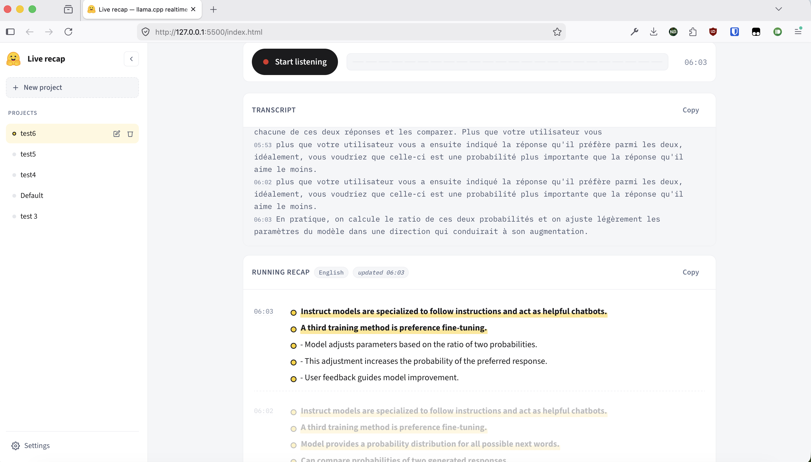

# Live recap — llama.cpp realtime voice

A single-page Vue 3 app that listens to a live talk through your microphone and produces a **running, bullet-point recap in your language** as the speaker talks. Built for the case where you're sitting in a foreign-language conference and want to keep up.

The whole pipeline runs on a single OpenAI-compatible `/v1/chat/completions` endpoint backed by a multimodal-audio model on llama.cpp — no separate transcription server needed.

  



---

## What it does

- **Listens continuously** through `MediaRecorder` and slices the audio into fixed-length chunks (default 10 s, configurable).
- **Each chunk is sent to llama.cpp** as base64 WAV in an OpenAI-style `input_audio` content part. The model returns the verbatim transcript of that chunk plus 0–3 new recap bullets in your target language.
- **Sliding-window context.** Earlier chunks in the window are replayed as `user(audio) → assistant(transcript)` pairs so the model has acoustic context for the new chunk, but old chunks fall off so the request never blows up the context.
- **Full session log in the UI.** Even though the LLM only sees the window, the user keeps every chunk on screen and on disk.
- **Resumable.** Everything is persisted, so you can refresh the tab mid-talk and pick up where you left off.

## UI

```
┌──────────────────────────────────────────┐
│ 🤗 Live recap        [save] [+] [⚙]      │  topbar + status pill
├──────────────────────────────────────────┤
│ ▾ Context for the recap                  │  optional prompt
│   [free text, e.g. "talk about LLM quan… │  fed into every API call
├──────────────────────────────────────────┤
│ [● Start listening]  ▌▌▌▌▌▌▌▌▌▌▌ 00:23   │  VU meter + session timer
├──────────────────────────────────────────┤
│ TRANSCRIPT                  [Copy]       │  last 4 chunks, mono
│  …last few sentences spoken…              │  small sliding window
├──────────────────────────────────────────┤
│ RUNNING RECAP    [English]  [Copy]       │  primary output
│  00:00  • Speaker opens the talk on…     │  bullets per chunk,
│  00:10  • A 7B model in fp16 is ~14 GB    │  streamed in live
│  00:20  • …                              │
└──────────────────────────────────────────┘
```

- **Space** — start/stop
- **Esc** — close settings dialog

## Stack

| | |
|---|---|
| Framework | Vue 3 (from CDN, global build) |
| Styling | Hugging Face design system (Source Sans 3 + IBM Plex Mono, HF palette) |
| Audio | `MediaRecorder` → `AudioContext` decode → `OfflineAudioContext` resample to 16 kHz mono → 16-bit PCM WAV → base64 |
| Backend | llama.cpp server, OpenAI-compatible `/v1/chat/completions` with audio input |
| Storage | `localStorage` (settings) + IndexedDB (sessions + chunks + audio blobs) |

Everything is vanilla JS / `<script>` tags. No build step, no bundler.

---

## File layout

```
.
├── index.html        # App shell + Vue x-template
├── styles.css        # App-specific styles (built on HF tokens)
├── colors_and_type.css   # HF design-system CSS variables
├── app.js            # Main Vue setup — pipeline, state, streaming, mock mode
├── db.js             # IndexedDB wrapper (projects / sessions / chunks)
├── audio.js          # webm/opus → 16 kHz mono WAV → base64
└── assets/
    ├── hf-logo.png
    ├── huggy-violinist.png  # empty-state illustration
    └── huggy-vibing.gif
```

---

## How the pipeline works

### Per chunk

```
mic ──► MediaRecorder ──► webm/opus blob (every N seconds)
                              │
                              ▼
                  decode + resample 16 kHz mono
                              │
                              ▼
                       16-bit PCM WAV
                              │
                              ▼
                            base64
                              │
                              ▼
                 POST /v1/chat/completions  (streaming SSE)
                              │
                              ▼
                   stream parser splits on
                       === RECAP ===
                              │
                ┌─────────────┴──────────────┐
                ▼                            ▼
        chunk.transcript            chunk.bullets[]
        (appended to top pane)     (streamed into recap pane)
```

### Request shape

```jsonc
{
  "model": "local",
  "stream": true,
  "messages": [
    { "role": "system", "content": "<system prompt with {{LANG}} substituted>" },

    // ─── sliding window: prior chunks as audio + their transcripts ───
    { "role": "user", "content": [
        { "type": "text", "text": "Prior audio segment." },
        { "type": "input_audio", "input_audio": { "data": "<b64 wav>", "format": "wav" } }
    ]},
    { "role": "assistant", "content": "<prior transcript>\n=== RECAP ===\n- prior bullet" },
    // …repeated for each prior chunk in the window…

    // ─── the new chunk ───
    { "role": "user", "content": [
        { "type": "text", "text": "Talk context: …\nPrior bullets: …\nLatest audio segment follows…" },
        { "type": "input_audio", "input_audio": { "data": "<b64 wav>", "format": "wav" } }
    ]}
  ]
}
```

### Expected model output (per turn)

```
<verbatim transcript of the latest segment in the source language>
=== RECAP ===
- new bullet 1 in <output language>
- new bullet 2
```

The marker is a literal string. If the model emits no bullets after it (or no marker at all), the chunk just contributes to the transcript and no new bullets are added.

---

## Persistence model

### Settings — `localStorage`

Key: `liveRecap.settings.v2`. Stored fields:

| field | type | default |
|---|---|---|
| `llmUrl` | string | `http://localhost:8080/v1/chat/completions` |
| `llmModel` | string | `local` |
| `apiKey` | string | `""` |
| `chunkSeconds` | number | `10` |
| `windowChunks` | number | `4` |
| `recapLanguage` | string | `English` |
| `systemPrompt` | string | (default prompt with `{{LANG}}` placeholder) |
| `mockMode` | boolean | `true` |

### History — IndexedDB

Database: `liveRecap`, version 1. The schema is intentionally future-proof for **multiple projects** (e.g. one per conference) — only the default project is exposed in the UI today.

```
projects                              sessions                             chunks
┌──────────────┐                      ┌──────────────────┐                 ┌─────────────────────────┐
│ id  (key)    │  1 ───── N           │ id  (key)        │  1 ───── N      │ id (key)                │
│ name         │ ◄──── projectId ──── │ projectId        │ ◄── sessionId ──│ sessionId               │
│ createdAt    │                      │ projectId        │                 │ projectId               │
│ updatedAt    │                      │ contextPrompt    │                 │ idx                     │
└──────────────┘                      │ startedAt        │                 │ time   (ms from start)  │
                                      │ endedAt          │                 │ transcript              │
                                      │ name (optional)  │                 │ bullets[]               │
                                      └──────────────────┘                 │ audioMime               │
                                                                           │ audioBlob (Blob)        │
                                                                           │ durationMs              │
                                                                           │ status                  │
                                                                           │ createdAt               │
                                                                           └─────────────────────────┘
```

Indexes:

- `projects.by-updated`
- `sessions.by-project`, `sessions.by-started`, `sessions.by-project-started`
- `chunks.by-session`, `chunks.by-session-idx`

Audio blobs are stored per-chunk so a session can be replayed or re-summarized with a different model later.

#### Session lifecycle

- **App mount** → ensure default project, load the latest session for it (frozen state).
- **Start listening** → resumes the current session (appends new chunks).
- **Stop** → just pauses recording. Session stays open.
- **+ (new session)** → marks the current session `endedAt` and creates a new blank one.

---

## Running it

### 1. Serve the files

Any static server works — the only "build" is concatenating four files:

```bash
python -m http.server 8000
# then open http://localhost:8000/
```

The mock mode is on by default, so the app is fully usable with no backend (it plays a fake French talk on LLM quantization).

### 2. Wire up llama.cpp

You need a llama.cpp server build with multimodal audio support (e.g. running a Qwen2-Audio / Ultravox-class model). Then in the settings dialog:

- **Endpoint** — `http://localhost:8080/v1/chat/completions` (or wherever your server is)
- **Model** — whatever the server expects
- **API key** — leave blank for local servers
- Turn **Mock mode** off

### Browser permissions

The app requests microphone access via `getUserMedia` when you press **Start listening**. Browsers require a secure context (HTTPS or `localhost`) for this — opening `index.html` directly via `file://` will not work for real audio capture, but mock mode still does.

---

## Roadmap / future work

- **Project picker** — the DB already supports multiple projects; expose creation/switching in the UI.
- **Sessions sidebar** — browse and reopen past sessions for a project.
- **Replay** — the audio is stored per chunk; play it back next to the transcript line.
- **Re-summarize** — point a stored session at a different model and regenerate the recap.
- **Export** — beyond the existing Markdown download, JSON + WAV-zip exports.
- **PWA** — install to home screen, offline shell.

---

## License

MIT.
